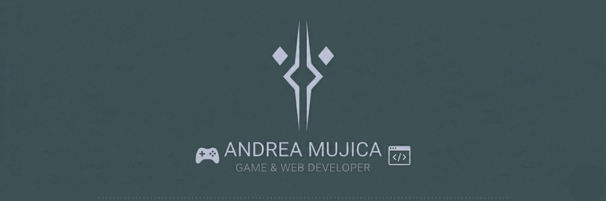

  

# Hi! I'm Andrea

🎮 **Currently building:** [Ninja Survivor](https://github.com/Andymms/ninja-survivor) — a browser-based action game inspired by Hollow Knight & Vampire Survivors (HTML5 Canvas, vanilla JS)

💻 **Full Stack Skills:** React, Python, JS, Flask, SQL, REST APIs, JWT, Bootstrap  
🐛 **Debugging & Testing:** Jest, manual testing, game loop debugging, collision system validation                                
🌎 **Remote from Venezuela** — available for LATAM/US time zones, EU flexible                                                    
📫 **Contact:** andreamm0714@gmail.com | +58 414-882-4717

---

## 💼 What I Do

**Full Stack Development:** Build complete web apps from database to UI (React + Flask + SQL)  
**Game Development:** Design mechanics, implement AI, polish game feel (JavaScript/Canvas)  
**Problem Solving:** Debug systems, optimize performance, validate user experiences

---

## 🚀 Featured Projects

| Project | Stack | What I Built |
|---------|-------|--------------|
| **[HiDoc Website](https://github.com/Andymms/HiDoc)** | React, Flask, SQL, JWT | Freelance platform for doctors with symptom-matching algorithm |
| **[Star Wars Blog](https://github.com/Andymms/Starwars-blog-reading-list)** | React, Context API, REST API | Dynamic blog consuming SWAPI with global state management |
| **[Ninja Survivor](https://github.com/Andymms/ninja-survivor)** | HTML5 Canvas, JavaScript | Action game with procedural enemy spawning, combat system, game feel |

---

## 🛠 Tech Stack

### 🌐 Frontend
    

### ⚙️ Backend & Tools
    

  

---

## 🎯 Currently Learning

- Game development (loops, AI, collision detection)
- Unity
- Technical art & game feel
*Open to: Junior Full Stack Developer • Junior Game Developer • Technical Support.*
---

  <i>"Experience outranks everything."</i>  
  <b>— Ahsoka Tano</b>

